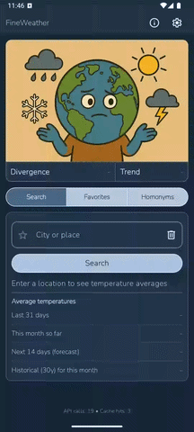

# FineWeather

FineWeather is an Android app that compares recent, forecast, and historic temperature averages for any city using Open-Meteo data.

## Features
- Search by city or place with geocoding, localized results, and alternate-match resolution for ambiguous names
- Average temperatures for the last 31 days, current month so far, and next 7 or 14 days
- Historical monthly baseline for the current month (1961-1990 or current 30-year normal)
- Divergence (this month vs. the historical baseline) and Trend (forecast vs. this month) comparisons, plus a warning when current-month data is limited
- Favorites for saving places locally and reopening them from a dedicated tab
- Settings for forecast length, historic reference, search language, and divergence method
- Local caching for geocode and weather data, with settings stored in DataStore

## Data sources
- Open-Meteo Forecast API, Archive API, and Geocoding API (no API key required)

## Tech stack
- Kotlin + Jetpack Compose (Material 3)
- MVVM with ViewModel + StateFlow
- Retrofit + Gson
- Room for caching and favorites
- DataStore Preferences for settings
- Coroutines

## Getting started
1. Open the project in Android Studio.
2. Ensure the Android SDK is installed (compileSdk 36, minSdk 27).
3. For CLI builds, use JDK 17 or newer (Android Studio's bundled JDK works).
4. Run the `app` configuration on an emulator or device.

### CLI builds
- `./gradlew assembleDebug`
- `./gradlew installDebug`

### Tests
- `./gradlew test`
- `./gradlew connectedAndroidTest`

## Settings
- Forecast length: 7 or 14 days
- Historic reference: 1961-1990 baseline or current 30-year normal ending at the last complete decade
- Search language: English, German, French, Spanish, Italian, Portuguese, Russian, Turkish, or Hindi
- Divergence method: absolute delta (raw °C difference) or normalized anomaly (standard deviations from baseline, to show how unusual the month is for that place)

## Project structure
- `app/src/main/java/com/example/fineweather/ui` Compose UI and screens
- `app/src/main/java/com/example/fineweather/viewmodels` UI state and business logic
- `app/src/main/java/com/example/fineweather/data` repositories, models, and Room entities
- `app/src/main/java/com/example/fineweather/api` Open-Meteo Retrofit services
- `app/src/main/java/com/example/fineweather/utils` shared helpers used across layers

## Credits
- Illustrations generated with AI
- Development: hand-written from the start of the project (March 2025); agentic coding tools (Claude Code) used from mid-2026 onward for responsiveness fixes, the CI/release pipeline, test fixes, and cleanup
